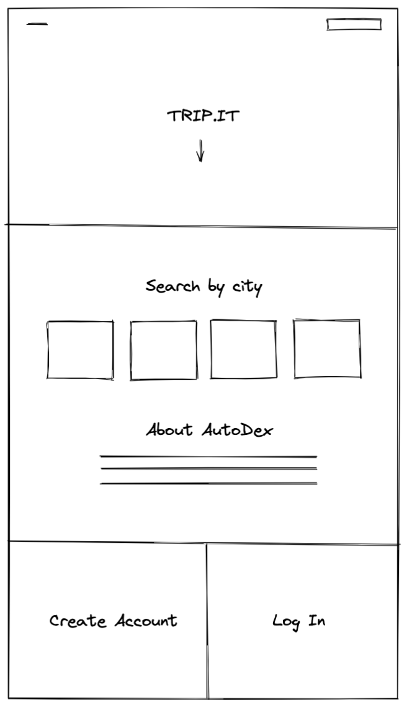
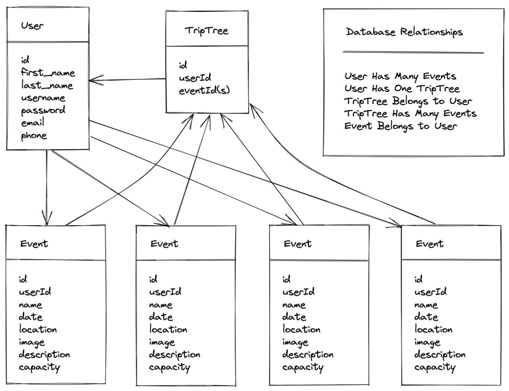

# trip.it

## User stories
As a user: I want to be able to search for upcoming events at my location or by searching a specific city. I want to be able to add events to my itinerary (TripTree) and get event updates and RSVP if event owner allows. Be able to create/edit personal profile. Stretch goal is to add ability for promotional discounts if booking events through the app.

As an admin: Be able to add, remove and edit events based on location and event dates/times. Be able to create/edit business/personal profile. Booking options and capacity limits. Stretch goal is top lists for accounts with high ratings.

## App Name Ideas
City trotter
Cititreat
Citytrip
Citilog
Citibound
Citiverse
urbantrotter
uplanner
Eventnow
event.logger
Event.try
Event.ly
eventure
Eventverse
Enventgator
Ventfinder
url.y
Nexstop
itinera
Hitch stop
Uvisit
Vizi
Vizi Finder
Vizilog
Vizitrip
Trip.it
Triptree
Trip journal
Travelocity
travelverse
Travelity
Velity
Travela
Pinstop
Local.xplorer
near.me
near.by
Localify
findry
Urbanaut
Urbanknot
Knotical
xplor
xPlot
xmark
mark.r

## Wireframe

## ERD
